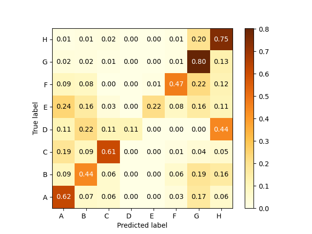

# Patent Classification
**Goal**: To train a machine learning classifier that can classify international patents into one of eight categories based on the content of their titles/abstracts. More information on the taxonomy of the patent classes is [available on the WIPO website](https://www.wipo.int/publications/en/series/index.jsp?id=183).

* The patent data is available as raw XML from this URL: https://bulkdata.uspto.gov/
* Each large zipped file contains a single file, with multiple XML blocks
* This repo contains preprocessing code (`preproc.py`) to organize these XML blocks into a form that can be parsed, and the relevant information extracted for classification purposes.
## Installation
This step assumes that Python 3.9+ is installed. Set up a virtual environment and install from requirements.txt:

```sh
$ python3 -m venv .venv
$ source .venv/bin/activate
$ pip3 install -r requirements.txt
```

For further development, simply activate the existing virtual environment.

```sh
$ source .venv/bin/activate
```

## Preprocessing
The preprocessing script requires that an unzipped raw XML file (with information on hundreds of patents) exists in the `raw_data/` directory. As an example, the following file is [downloaded from the source](https://bulkdata.uspto.gov/data/patent/grant/redbook/2020/I20200107.tar), uncompressed, and stored in the below path in XML format:

* `raw_data/ipgb20200107_wk01/ipgb20200107.xml`

Because the large XML file is not directly parsable, it needs to be broken down into individual blocks, each of which constitute a valid XML tree. This can then be parsed, and the relevant information extracted. Using this approach, we can organize the information into a form that can be used to train an ML classifier.

Run the preprocessing script (after editing the path to the raw data appropriately) as follows:

```sh
$ python3 preproc.py
```
This produces a new directory with clean, parsable XML files, and writes out the data to a JSON file (`data.json`). The JSON data consists of the following key-value pairs:

```py
data = {
    "doc_id": doc_id,
    "title": title,
    "abstract": abstract,
    "label": section_label,
}
```
Note that the `section_label` field refers to the top-level of the classification hierarchy, which belongs to one of eight classes: A, B, C, D, E, F, G or H. Each letter refers to a particular section label from the IPC hierarchy (Physics, Chemistry, Engineering, etc.). More information on this can be found on the WIPO website:

> [Guide to the International Patent Classification, 2020 Edition](https://www.wipo.int/edocs/pubdocs/en/wipo_guide_ipc_2020.pdf), part II, p5.

---

## Baseline model: Linear Support Vector Machine (SVM)

The baseline model trained is a linear SVM, via the [`sklearn` library's `SGDClassifier`](https://scikit-learn.org/stable/modules/generated/sklearn.linear_model.SGDClassifier.html)). This model implements an L2-regularized linear model with stochastic gradient descent and mini-batching, making it a good choice for quickly training a reasonable model for benchmarking purposes.

### Additional data processing steps
To reduce the number of redundant features the model has to learn, it makes sense to clean up the text data in a way that words are collapsed to their root form. Lemmatization is a good option, as it reduces inflectional forms of a word ("condenses" becomes "condense"). [**spaCy**](https://spacy.io/) is an NLP library that allows us to efficiently process and lemmatize text through a lookup process that can be made concurrent to deal with large amounts of data in batches.

The following data processing steps are performed on the `data.json` file generated in the previous step:
* __Lowercasing__: Further reduces the number of features to be learned ("Condense" and "condense" mean one and the same thing)
* __Stopword removal__: Allows us to ignore useless tokens that don't add discriminatory potential ("a", "an", "the")
* __Lemmatization__: Reduces inflectional forms of words to their root form (lemmas)
* __Combine title and abstract__: The title of a patent contains useful tokens that are commonly repeated in the abstract -- this could help strengthen the training signal by allowing the model to learn the importance of repeated tokens across classes

### Cost-sensitive weighting
In a classification task, it is possible to consider misclassification cost into account during training. This is done by changing the penalty imposed on the learner for misclassifying classes, based on the proportion of training samples per class. In `sklearn`, this can be done by applying a balanced weighting function. The “balanced” term implies that the values of the true class labels are adjusted using weights that are inversely proportional to class frequencies in the input data as `n_samples / (n_classes * np.bincount(y))`. The following results are obtained.

```
{
    'A': 0.9547325102880658,
    'B': 1.0943396226415094,
    'C': 2.005763688760807,
    'D': 24.857142857142858,
    'E': 6.444444444444445,
    'F': 2.005763688760807,
    'G': 0.3945578231292517,
    'H': 0.43256681168427596
}
```
The weighting factors above make sense: Class 'D' has the highest weight because it has by far the fewest training samples. Class 'G' has the lowest weight because it has the most number of training samples.

```
Number of training samples:
G    2177
H    2019
A     919
B     810
F     432
C     421
E     145
D      37
```

### Experiments

#### 1. Hinge loss, no class weighting
The default loss function, which is `hinge` loss, gives a linear SVM. The initial training run is made without handling class imbalance, i.e., with equal cost weighting applied to all classes, to see the effect of later experiments. The following results are obtained.

```
Macro F1: 51.368 %
Micro F1: 64.799 %
Weighted F1: 63.412 %
Accuracy: 64.799 %
```



This initial classifier is a rather poor one, because, as the confusion matrix shows, it has poor discrimatory power toward the minority classes ('D' and 'E'). 

#### 2. Hinge loss, with balanced class weighting
To address class imbalance, the next attempt is to apply a cost-sensitive weighting function to the classes during training, as shown above. The following results are obtained. The overall accuracy and weighted F1-scores are slightly lower than before, but, there is a slight increase in Macro F1-score, indicating that the cost-sensitive weighting improves the classifier's sensitivity to the minority classes.

```
Macro F1: 52.900 %
Micro F1: 61.422 %
Weighted F1: 62.315 %
Accuracy: 61.422 %
```


From the confusion matrix, it is clear that the minority classes 'D' and 'E' are much better predicted in this model. However, the overall accuracy and F1 scores dropped because of a loss of performance across the other classes, likely due to underfitting and an insufficient degree of convergence.

#### 3. Modified Huber loss, with balanced class weighting
Modified Huber is another smooth loss function that is more tolerant to outliers in the feature space as compared to mean-squared loss (typically used in regression problems). As mentioned in the [`sklearn` documentation](https://scikit-learn.org/stable/modules/generated/sklearn.linear_model.SGDClassifier.html), this loss function can prove useful in classification problems as well, as it brings more tolerance to the probability estimates as well. This results in improved performance as shown below.

```
Macro F1: 58.294 %
Micro F1: 66.236 %
Weighted F1: 66.725 %
Accuracy: 66.236 %
```

In this case, the macro F1-score is the highest among all the cases, because of uniformly better performance across all classes. The weighted F1-score and accuracy are also significantly higher than the cases which used hinge loss, indicating that this choice of loss function is more suited to the feature space of our problem.

### Best `SGDClassifier` model parameters for the baseline
Without running any further hyperparameter tuning or grid search experiments, the best baseline model results were obtained using the below parameters.

```py
(
    "clf",
    SGDClassifier(
        loss="modified_huber",
        penalty="l2",
        alpha=1e-3,
        random_state=42,
        max_iter=100,
        learning_rate="optimal",
        tol=None,
    ),
)
```

The following normalized confusion matrix was obtained with the best model that uses the modified Huber loss function.


Each value in a cell represents the fraction of samples in each class that were correctly classified. As can be seen, applying class weighting based on the imbalance in the training data still produces moderately okay results for the minority classes (G and H in this dataset.)
## Can we do better with transformers?
In progress...
