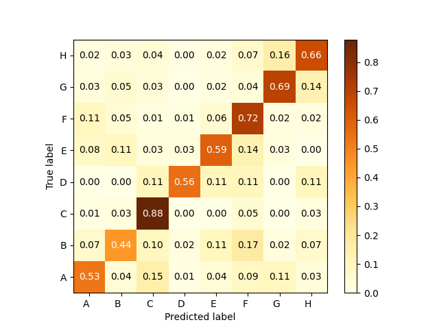
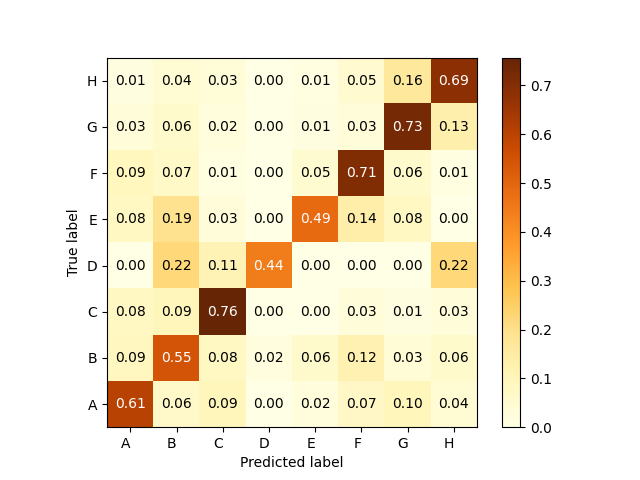

# Patent Classification
**Goal**: To train a machine learning classifier that can automatically classify international patents [downloaded from the WIPO website](https://www.wipo.int/classifications/ipc/en/) into one of eight categories based on the textual content of their titles/abstracts.

* The patent data is available as raw XML from this URL: https://bulkdata.uspto.gov/
* Each large zipped file contains a single file, with multiple XML blocks
* This repo contains preprocessing code (`preproc.py`) to organize these XML blocks into a form that can be parsed, and the relevant information extracted for classification purposes.

The patent top-level section labels that are of interest are as follows:
```
A, B, C, D, E, F, G, H

A: Human necessities
B: Performing operations; transporting
C: Chemistry; metallurgy
D: Textiles; paper
E: Fixed constructions
F: Mechanical engineering; lighting; heating; weapons; blasting
G: Physics
H: Electricity
```

A detailed guide to the WIPO classification taxonomy is [available on the WIPO website](https://www.wipo.int/publications/en/series/index.jsp?id=183).
In addition, more information on the content taxonomy is available in the following document:

> [Guide to the International Patent Classification, 2020 Edition](https://www.wipo.int/edocs/pubdocs/en/wipo_guide_ipc_2020.pdf), part II, p5.


## Installation
This step assumes that Python 3.9+ is installed. Set up a virtual environment and install from requirements.txt:

```sh
$ python3 -m venv .venv
$ source .venv/bin/activate
$ pip3 install -r requirements.txt
```

For further development, simply activate the existing virtual environment.

```sh
$ source .venv/bin/activate
```
### Download and install spaCy language model
Within the activated virtual environment, once the dependencies are installed from `requirements.txt`, run the following command:

```
$ python3 -m spacy download en_core_web_sm
```
This provides the standard (small) spaCy's English language model for downstream lemmatization, explained below.

## Preprocessing
The preprocessing script requires that an unzipped raw XML file (with information on hundreds of patents) exists in the `raw_data/` directory. As an example, the following file is [downloaded from the source](https://bulkdata.uspto.gov/data/patent/grant/redbook/2020/I20200107.tar), uncompressed, and stored in the below path in XML format:

* `raw_data/ipgb20200107_wk01/ipgb20200107.xml`

Because the large XML file is not directly parsable, it needs to be broken down into individual blocks, each of which constitute a valid XML tree. This can then be parsed, and the relevant information extracted. Using this approach, we can organize the information into a form that can be used to train an ML classifier.

Run the preprocessing script (after editing the path to the raw data appropriately) as follows:

```sh
$ python3 preproc.py
```
This produces a new directory with clean, parsable XML files, and writes out the data to a JSON file (`data.json`). The JSON data consists of the following key-value pairs:

```py
data = {
    "doc_id": doc_id,
    "title": title,
    "abstract": abstract,
    "label": section_label,
}
```
Note that the `section_label` field here refers to the top-level of the classification hierarchy (8 categories, from A-H).
---

## Baseline model: Linear Support Vector Machine (SVM)

The baseline model trained is a linear SVM, via the [`sklearn` library's `SGDClassifier`](https://scikit-learn.org/stable/modules/generated/sklearn.linear_model.SGDClassifier.html)). This model implements an L2-regularized linear model with stochastic gradient descent and mini-batching, making it a good choice for quickly training a reasonable model for benchmarking purposes.

### Additional data processing steps
To reduce the number of redundant features the model has to learn, it makes sense to clean up the text data in a way that words are collapsed to their root form. Lemmatization is a good option, as it reduces inflectional forms of a word ("condenses" becomes "condense"). [**spaCy**](https://spacy.io/) is an NLP library that allows us to efficiently process and lemmatize text through a lookup process that can be made concurrent to deal with large amounts of data in batches.

The following data processing steps are performed on the `data.json` file generated in the previous step:
* __Lowercasing__: Further reduces the number of features to be learned ("Condense" and "condense" mean one and the same thing)
* __Stopword removal__: Allows us to ignore useless tokens that don't add discriminatory potential ("a", "an", "the")
* __Lemmatization__: Reduces inflectional forms of words to their root form (lemmas)
* __Combine title and abstract__: The title of a patent contains useful tokens that are commonly repeated in the abstract -- this could help strengthen the training signal by allowing the model to learn the importance of repeated tokens across classes

### Cost-sensitive weighting
In a classification task, it is possible to consider misclassification cost into account during training. This is done by changing the penalty imposed on the learner for misclassifying classes, based on the proportion of training samples per class. In `sklearn`, this can be done by applying a balanced weighting function. The “balanced” term implies that the values of the true class labels are adjusted using weights that are inversely proportional to class frequencies in the input data as `n_samples / (n_classes * np.bincount(y))`. The following results are obtained.

```
{
    'A': 0.9547325102880658,
    'B': 1.0943396226415094,
    'C': 2.005763688760807,
    'D': 24.857142857142858,
    'E': 6.444444444444445,
    'F': 2.005763688760807,
    'G': 0.3945578231292517,
    'H': 0.43256681168427596
}
```
The weighting factors above make sense: Class 'D' has the highest weight because it has by far the fewest training samples. Class 'G' has the lowest weight because it has the most number of training samples.

```
Number of training samples:
G    2177
H    2019
A     919
B     810
F     432
C     421
E     145
D      37
```

### Experiments and SVM results

The SVM trainer and evaluator is run as follows:
```
$ python3 classifier_svm.py
```

#### 1. Hinge loss, no class weighting, l2-reg alpha=0.0005
The default loss function, which is `hinge` loss, gives a linear SVM. The initial training run is made without handling class imbalance, i.e., with equal cost weighting applied to all classes, to see the effect of later experiments. The following results are obtained.

```
Macro F1: 53.349 %
Micro F1: 66.595 %
Weighted F1: 65.570 %
Accuracy: 66.595 %
```


This initial classifier is a rather poor one, because, as the confusion matrix shows, it has poor discrimatory power toward the minority classes ('D' and 'E'). 

#### 2. Hinge loss, with balanced class weighting, l2-reg alpha=0.0005
To address class imbalance, the next attempt is to apply a cost-sensitive weighting function to the classes during training, as shown above. The following results are obtained. The overall accuracy and weighted F1-scores are slightly lower than before, but, there is a slight increase in Macro F1-score, indicating that the cost-sensitive weighting improves the classifier's sensitivity to the minority classes.

```
Macro F1: 56.192 %
Micro F1: 63.721 %
Weighted F1: 64.544 %
Accuracy: 63.721 %
```



From the confusion matrix, it is clear that the minority classes 'D' and 'E' are much better predicted in this model. However, the overall accuracy and F1 scores dropped because of a loss of performance across the other classes, likely due to underfitting and an insufficient degree of convergence.

#### 3. Modified Huber loss, with balanced class weighting, l2-reg alpha=0.0005
Modified Huber is another smooth loss function that is more tolerant to outliers in the feature space as compared to mean-squared loss (typically used in regression problems). As mentioned in the [`sklearn` documentation](https://scikit-learn.org/stable/modules/generated/sklearn.linear_model.SGDClassifier.html), this loss function can prove useful in classification problems as well, as it brings more tolerance to the probability estimates as well. This results in improved performance as shown below.

```
Macro F1: 59.116 %
Micro F1: 66.739 %
Weighted F1: 67.220 %
Accuracy: 66.739 %
```

In this case, the macro F1-score is the highest among all the cases, because of uniformly better performance across all classes. The weighted F1-score and accuracy are also significantly higher than the cases which used hinge loss, indicating that this choice of loss function is more suited to the feature space of our problem.

### Best `SGDClassifier` model parameters for the baseline
Without running any further hyperparameter tuning or grid search experiments, the best baseline model results were obtained using the below parameters.

```py
(
    "clf",
    SGDClassifier(
        loss="modified_huber",
        penalty="l2",
        alpha=5e-4,
        random_state=42,
        max_iter=100,
        learning_rate="optimal",
        tol=None,
    ),
)
```

The following normalized confusion matrix was obtained with the best model that uses the modified Huber loss function.



Each value in a cell represents the fraction of samples in each class that were correctly classified. As can be seen, applying class weighting based on the imbalance in the training data results in model with a moderately decent predictive power for the majority and minority classes in this dataset.

---
## Can we do better with transformers?

### 🤗 DistilBERT

The DistilBERT model was first proposed in the paper [DistilBERT, a distilled version of BERT: smaller, faster, cheaper and lighter](https://arxiv.org/abs/1910.01108). It has **40%** less parameters than `bert-base-uncased`, runs **60%** faster while preserving over **95%** of BERT’s performance as measured on the GLUE language understanding benchmark.

#### Data preprocessing and tokenization

We use the `distilbert-base-uncased` tokenizer. Case-sensitivity is not a concern in this dataset because typical patents we encounter consist of well-formatted text with almost no typos/misspellings, and we would expect words in the data to retain context regardless of capitalization.

The data is loaded and transformed (i.e., encoded into input IDs with attention masks) through a combination of the Hugging Face [Datasets library](https://huggingface.co/docs/datasets/), as well as their [Tokenizers library](https://github.com/huggingface/tokenizers). The Datasets pipeline allows us to easily generate train/validation/test splits from a range of raw data sources, and the Tokenizers pipeline efficiently encodes the vocabulary of the dataset into a form that the DistilBERT `trainer` instance can make use of.

#### Model training
The model is trained using the `classifier_distilbert_train.py` script provided in this repo as follows.

```
$ python3 classifier_distilbert_train.py
```
Verify that the training loss goes down in each epoch, and that the validation F1 increases accordingly. This outputs the model weights to the `pytorch_model/` directory

#### Model optimization and compression

A big concern with deep learning models is the computational cost associated with making inferences on real world data in production. One approach to make the inference process more efficient is to optimize and quantize the PyTorch model via [ONNX](https://github.com/onnx/onnx), an open source framework that provides a standard interface for optimizing deep learning models and their computational graphs.

On average, a **30x** speedup in CPU-based inference, along with a **4x** reduction in model size is observed for an optimized, quantized DistilBERT-ONNX model (compared to the base DistilBERT-PyTorch model that we trained on GPU).

### Use 🤗 Hugging Face command line module to convert to ONNX

See the [PyTorch documentation](https://pytorch.org/docs/stable/quantization.html) for a more detailed description of quantization, as well as the difference between static and dynamic quantization.

The following command is used to convert the PyTorch model to an ONNX model. First, `cd` to an **empty directory** in which we want the ONNX model file to be saved, and then specify the source PyTorch model path (that contains a valid `config.json`) in relation to the current path. An example is shown below.

```sh
# Assume that the PyTorch model weights (.bin file) are in the pytorch_model/ directory
$ cd onnx_model
$ python3 -m transformers.convert_graph_to_onnx \
  --framework pt \
  --model pytorch_model \
  --tokenizer distilbert-base-uncased \
  --quantize onnx_model \
  --pipeline sentiment-analysis
```

Note that we need to specify the `--pipeline sentiment-analysis` argument to avoid input array broadcasting issues as per the Hugging Face API. Specifying the `sentiment-analysis` argument forces it to use sequence classification tensor shapes during export, so the correct outputs are sent to the ONNX compute layers.

The quantized ONNX model file is then generated with in the current directory, which can then be used to make much more rapid inferences on CPU.

### DistilBERT results
The evaluation script `classifier_distilbert_evaluate.py` is run to produce the following results.

```
$ python3 classifier_distilbert_evaluate.py
```

```
Macro F1: 64.050 %
Micro F1: 80.603 %
Weighted F1: 80.041 %
Accuracy: 80.603 %
```


Although the transformer-based classifier is performing much, much better on the majority classes ("G", "H"), the confusion matrix shows that it has almost no predictive power toward the minority classes (especially "D", which had far too few training samples -- just 37 overall in the original data).

#### Remedy
The best way to improve the DistilBERT classifier's predictive power toward the minority class would be to obtain more training samples and to reduce overall class imbalance. This can be done by scraping and obtaining more patent data over multiple months for the minority classes ("D" and "E"). In general, a few hundred training samples per class should suffice during fine-tuning transformer models (a couple thousand would be ideal).

In addition, just like in the case with the SVM, it is possible to perform cost-sensitive weighting for the transformer model by subclassing the `Trainer` instance and passing the class weights to the `CrossEntropy` loss as follows:

```py
class CostSensitiveTrainer(Trainer):
    def compute_loss(self, model, inputs, return_outputs=False):
        labels = inputs.get("labels")
        outputs = model(**inputs)
        logits = outputs.get("logits")
        loss_fct = torch.nn.CrossEntropyLoss(weight=weights)
        loss = loss_fct(
            logits.view(-1, self.model.config.num_labels),
            labels.float().view(-1, self.model.config.num_labels),
        )
        return (loss, outputs) if return_outputs else loss
```

See [this GitHub issue](https://github.com/huggingface/transformers/issues/7024) on the 🤗 Hugging Face transformers repo for more details.

Happy training!